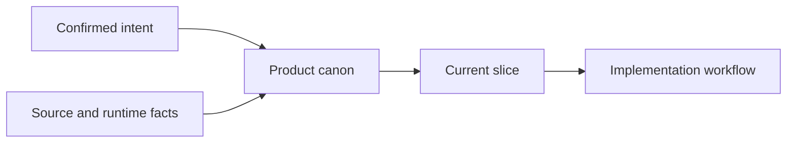

# Product Canon

> 把已确认的产品意志，整理成稳定的产品核心文档，再收敛成一个可独立演示的实现切片。
>
> Turn confirmed product intent into a stable product canon and one independently demonstrable implementation slice.

## What this is

`product-canon` is a Codex skill for keeping product decisions authoritative, bounded, and useful to implementation. It helps a team answer two questions before building:

1. What has the user actually decided?
2. What is the smallest complete result worth implementing now?



## When to use it

| Need | Skill mode | Result |
| --- | --- | --- |
| Start a product | 建立 / Establish | A minimal core document structure |
| Correct a decision | 修正 / Correct | The current decision replaces the outdated one |
| Check product truth | 审计 / Audit | Conflicts, omissions, duplication, and scope drift |
| Choose what to build | 选切片 / Select slice | One user-visible result with clear acceptance evidence |

## Use

In a Codex-compatible environment, invoke the skill with:

```text
Use $product-canon to turn confirmed product intent into a stable product canon and one bounded implementation slice.
```

The skill reads only the context needed for the current decision, then returns:

- the current product conclusion;
- conflicts or omissions in the canon;
- the actual document locations to change;
- one bounded implementation-slice brief;
- decisions that still need the user's authority.

## Boundaries

- User-confirmed intent outranks old chats, reports, tests, and local implementation details.
- Product contracts define the goal; source and runtime evidence describe current reality.
- One slice must produce a user-visible result that can be demonstrated or accepted on its own.
- The skill does not create a second task system, gate, scheduler, database, or product authority.
- Real vendors, real accounts, live orders, persistent automation, and database migrations require explicit scope and authorization.

## Repository layout

```text
.
├── SKILL.md            # Skill instructions and operating boundaries
└── agents/openai.yaml  # Display metadata and default invocation prompt
```

## Design principle

> Fix the authority and the slice before adding implementation surface area.

See [`SKILL.md`](SKILL.md) for the complete workflow and output contract.
