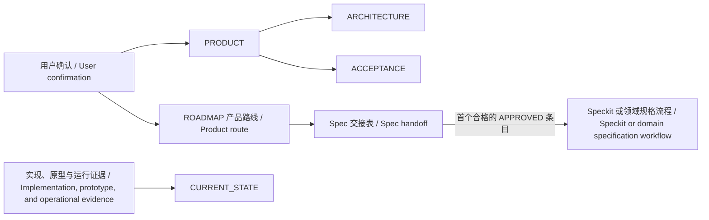

# 产品典籍 Product Canon

<p align="center">
  
</p>

<p align="center">
  <strong>固定五个产品权威入口，让目标、路线和当前事实各归其位。</strong><br>
  <sub>Five stable product authorities. One deliberate foundation for delivery.</sub>
</p>

---

## 中文说明

`product-canon` 是一个面向仓库内技术产品开发的低频 Codex skill（技能）。它只在产品定调初始化，或用户明确要求重新归并产品核心愿景、需求和用户意志时运行。

它把已确认的产品决定和当时可验证的起点事实整理为固定五份核心文档。它不负责日常审计、整理、纠错、状态刷新、ROADMAP 维护、Spec 编写或具体实施。

适用对象包括软件、AI/模型/数据、硬件/固件/IoT/机器人，以及软硬件混合技术产品。产品必须具有版本化项目空间、明确用户结果、可说明的系统结构、可验证完成条件、交付路线和当前实现/原型/运行证据。泛项目管理、营销或内容工作、个人计划，以及没有产品交付目标的纯研究不适用。

### 固定五文件

执行初始化或显式归并重建时，只在 `docs/product/` 建立以下五个产品权威入口：

| 文件 | 唯一职责 |
| --- | --- |
| `PRODUCT.md` | 产品承诺、用户结果、可见行为、配置方式和永久边界 |
| `ARCHITECTURE.md` | 系统上下文、数字/物理组件责任、单一控制/状态/数据权威、关键路径和故障不变量 |
| `ACCEPTANCE.md` | 完成判定、所需证据、失败/恢复证据和不证明事项 |
| `ROADMAP.md` | 完整产品路线，以及已批准交付结果的顺序、状态和 Spec 交接 |
| `CURRENT_STATE.md` | 建制当时已验证、未验证和阻塞的实现/原型/运行事实及证据指针 |

模板只固定文件名、职责和最小骨架。信息不足时写 `UNKNOWN` 或 `NOT_VERIFIED`，不靠猜测补齐，也不新增第六个核心权威文件。

### 只在两类场景使用

| 场景 | 入口 | 结果 |
| --- | --- | --- |
| 用户初始化仓库内技术产品并确定方向，或产品类 `grilling` 已结束且用户确认共同理解 | 技术产品定调初始化（含 Grilling 交接） | 创建固定五文件并落入已确认决定 |
| 用户明确要求归纳重建当前技术产品的核心、愿景、需求或用户核心意志 | 显式归并重建 | 完整迁移有效决定并保留非核心材料 |

普通阅读、审核、审计、整理、纠错、状态刷新、ROADMAP 维护、Spec 核对、验收检查和实现工作都不触发本 Skill。

### 权威与交付关系



`ROADMAP.md` 必须同时保留两个层次：

- **产品路线**：完整保存已确认的阶段、能力范围、顺序和未决事项；它本身不产生 Spec。
- **Spec 交接表**：只放用户明确批准、可以独立演示和验收的近期交付结果；只有这张表参与切片。

交接表为空是合法状态。ROADMAP ID 由产品讨论确定，不能从 `011-*` 等 Spec 目录编号反推。旧 Spec 不会因为目录存在而自动绑定、拆分或扩张。

固定交接表结构：

```text
ID | User outcome | Boundary | Dependencies | Acceptance | Status | Spec
```

软件项目使用 Speckit 时，它只能为合格的 `APPROVED` 条目填写 `Spec` 路径并推进状态，不能改写已经批准的用户结果、边界或验收。

这里的 `Spec` 表示正式交付规格或等价技术规格。软件项目可以绑定 Speckit Spec；其它技术产品可以绑定模型评测、固件、硬件原型、系统集成或验证规格。Speckit 是可选消费者，不是所有领域都必须使用的工具。

### 非核心文档继续保留

固定五文件只限制产品核心权威入口，不限制仓库的文档总数。以下材料可以继续独立存在：

- `AGENTS.md`、Spec、plan、tasks 和开发说明；
- 合规、许可、第三方 provenance（来源归属）和 vendor 原文；
- 源码、模型、数据集、固件、CAD/BOM、API 参考、ADR、设计稿、研究资料和历史归档；
- 测试、评测、原型/设备验证、运行证据、发布回执和迁移说明。

它们可以提供输入、参考、历史或证据，但不能与五个核心文件争夺产品权威。

### 使用方法

技术产品定调初始化：

```text
使用 $product-canon，为这个仓库内的技术产品定调并初始化固定五个产品核心文件；未知决定保持 UNKNOWN，不创建 Spec。
```

显式归并重建：

```text
使用 $product-canon，归并重建这个仓库内技术产品的核心愿景、需求和用户意志；完整保留有效产品路线与非核心历史，不创建 Spec。
```

### 仓库结构

```text
.
├── SKILL.md
├── README.md
├── agents/openai.yaml
├── scripts/validate_core_docs.py
└── assets
    ├── product-canon-logo.svg
    └── core-docs
        ├── PRODUCT.md
        ├── ARCHITECTURE.md
        ├── ACCEPTANCE.md
        ├── ROADMAP.md
        └── CURRENT_STATE.md
```

### 验证

```text
python scripts/validate_core_docs.py assets/core-docs
```

项目归并重建完成后，对项目五文件增加 `--migration`：

```text
python scripts/validate_core_docs.py <project>/docs/product --migration
```

> 产品意志归 `PRODUCT`，系统责任归 `ARCHITECTURE`，完成证据归 `ACCEPTANCE`，完整路线与 Spec 交接归 `ROADMAP`，建制时的实现、原型和运行事实归 `CURRENT_STATE`。

完整运行规则见 [`SKILL.md`](SKILL.md)。

---

## English

`product-canon` is a low-frequency Codex skill for technical products developed in a repository or versioned project workspace. It runs only when the product is being initialized and given a durable direction, or when the user explicitly asks to consolidate and re-found its core vision, requirements, and user intent.

It organizes confirmed product decisions and the verifiable starting truth into exactly five core documents. It does not perform routine audits, cleanup, corrections, status refreshes, ROADMAP maintenance, Spec authoring, or implementation.

It applies to software, AI/model/data, hardware/firmware/IoT/robotics, and hybrid technical products. A qualifying product has a versioned workspace, explicit user outcomes, an explainable system structure, verifiable completion conditions, a delivery route, and current implementation, prototype, or operational evidence. Generic project management, marketing or content work, personal planning, and research without a product delivery target are out of scope.

### The fixed five documents

During initialization or an explicit canon re-foundation, create exactly these five product-authority entry points under `docs/product/`:

| File | Sole responsibility |
| --- | --- |
| `PRODUCT.md` | Product promise, user outcomes, visible behavior, configuration, and permanent boundaries |
| `ARCHITECTURE.md` | System context, digital/physical component responsibilities, single control/state/data authorities, critical paths, and failure invariants |
| `ACCEPTANCE.md` | Completion criteria, required evidence, failure/recovery evidence, and what each proof does not establish |
| `ROADMAP.md` | The complete product route plus the order, status, and Spec handoff for approved delivery outcomes |
| `CURRENT_STATE.md` | Implementation/prototype/operational facts that were verified, unverified, or blocked at the time the canon was established, with evidence pointers |

The templates fix only the filenames, responsibilities, and minimum structure. Use `UNKNOWN` or `NOT_VERIFIED` when information is missing. Never guess and never create a sixth core authority file.

### Use it in only two situations

| Situation | Entry | Result |
| --- | --- | --- |
| The user initializes a repository-based technical product and sets its direction, or a product-focused `grilling` interview has ended with confirmed shared understanding | Technical-product initialization, including a Grilling handoff | Create the fixed five documents and materialize the confirmed decisions |
| The user explicitly asks to consolidate/rebuild the technical product's core vision, requirements, or user intent | Explicit canon re-foundation | Preserve every still-valid decision and keep non-canon material |

Do not trigger this skill for ordinary reading, reviews, audits, cleanup, corrections, status refreshes, ROADMAP maintenance, Spec checks, acceptance checks, or implementation work.

### Authority and delivery

`ROADMAP.md` must preserve two distinct layers:

- **Product route**: the complete set of confirmed stages, capability scope, sequence, and unresolved route decisions. This layer does not create Specs.
- **Spec handoff table**: only near-term, independently demonstrable outcomes explicitly approved by the user. Only this table participates in slicing.

An empty handoff table is valid. Product discussion owns ROADMAP IDs; never derive them from Spec directory numbers such as `011-*`. Existing Specs do not bind, split, or expand ROADMAP entries merely because their directories exist.

The fixed handoff schema is:

```text
ID | User outcome | Boundary | Dependencies | Acceptance | Status | Spec
```

Speckit may fill the `Spec` path and advance the status of a qualified `APPROVED` row. It may not rewrite the approved user outcome, boundary, or acceptance.

Here, `Spec` means a formal delivery specification or equivalent technical specification. Software projects may bind a Speckit Spec; other technical products may bind model-evaluation, firmware, hardware-prototype, system-integration, or validation specifications. Speckit is an optional consumer, not a universal tool requirement.

### Non-canon documents remain available

The fixed-five rule limits only core product-authority entry points, not the total number of repository documents. The following may remain independent:

- `AGENTS.md`, Specs, plans, tasks, and development notes;
- compliance, licenses, third-party provenance, and vendor source material;
- source, models, datasets, firmware, CAD/BOM, API references, ADRs, designs, research, and historical archives;
- tests, evaluations, prototype/device verification, runtime evidence, release receipts, and migration notes.

They may provide input, reference, history, or evidence, but they do not compete with the five core authorities.

### Usage

Technical-product initialization:

```text
Use $product-canon to set the direction of this repository-based technical product and initialize the fixed five core product documents. Keep unknown decisions as UNKNOWN and do not create a Spec.
```

Explicit canon re-foundation:

```text
Use $product-canon to consolidate and re-found this repository-based technical product's core vision, requirements, and user intent. Preserve the complete valid product route and non-canon history. Do not create a Spec.
```

### Repository layout

```text
.
├── SKILL.md
├── README.md
├── agents/openai.yaml
├── scripts/validate_core_docs.py
└── assets
    ├── product-canon-logo.svg
    └── core-docs
        ├── PRODUCT.md
        ├── ARCHITECTURE.md
        ├── ACCEPTANCE.md
        ├── ROADMAP.md
        └── CURRENT_STATE.md
```

### Validation

```text
python scripts/validate_core_docs.py assets/core-docs
```

After an explicit project re-foundation, validate the project's five documents with `--migration`:

```text
python scripts/validate_core_docs.py <project>/docs/product --migration
```

> Product intent belongs in `PRODUCT`; system responsibility in `ARCHITECTURE`; completion evidence in `ACCEPTANCE`; the complete route and Spec handoff in `ROADMAP`; and current implementation, prototype, and operational truth in `CURRENT_STATE`.

Complete operational rules are defined in [`SKILL.md`](SKILL.md).
