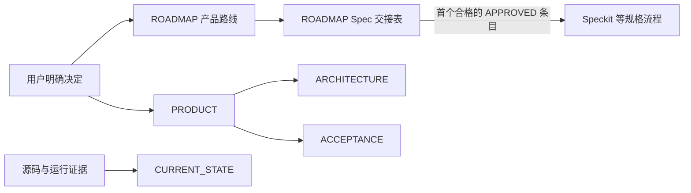

# 产品典籍 Product Canon

<p align="center">
  
</p>

<p align="center">
  <strong>固定五个产品权威入口，让目标、交付顺序和当前事实各归其位。</strong><br>
  <sub>Five stable product authorities. One clear handoff to delivery.</sub>
</p>

> 把用户确认的产品意志与可验证的当前事实，整理成稳定、简洁、互不争权的产品核心文档。

`product-canon` 是一个低频 Codex skill（技能），只负责项目定调初始化、完成产品追问后的落盘，或用户明确要求的核心意志归并重建。它不负责日常审计、整理、纠错或状态维护，也不创建 Spec、不拆实施切片。

<details>
<summary>English summary</summary>

`product-canon` initializes or explicitly re-founds exactly five authoritative product documents. It is not a routine audit or maintenance tool and hands only user-approved ROADMAP entries to specification workflows such as Speckit.
</details>

## 固定五文件 Five authorities

执行项目定调初始化或显式归并重建时，只在 `docs/product/` 建立以下五个核心文件：

| 文件 | 唯一职责 |
| --- | --- |
| `PRODUCT.md` | 产品承诺、用户结果、可见行为、配置方式和永久边界 |
| `ARCHITECTURE.md` | 组件责任、单一状态/数据权威、关键路径和故障不变量 |
| `ACCEPTANCE.md` | 完成判定、所需证据、失败/恢复证据和不证明事项 |
| `ROADMAP.md` | 完整产品路线，以及用户批准的纵向交付结果、依赖、状态和 Spec 交接 |
| `CURRENT_STATE.md` | 当前源码与运行环境已验证、未验证、阻塞和证据指针 |

模板只固定文件名、职责和最小骨架，不强迫所有产品采用相同业务章节。未知内容写 `UNKNOWN` 或 `NOT_VERIFIED`，不靠猜测补齐。



## 什么时候使用 When to use

| 场景 / Need | 入口 / Entry | 结果 / Result |
| --- | --- | --- |
| 初始化项目并确定产品方向，或产品类 Grilling 已确认完成 | 项目定调初始化（含 Grilling 交接） | 创建固定五文件并落入已确认决定 |
| 用户明确要求归纳重建核心、愿景和需求 | 显式归并重建 | 完整迁移旧意志并保留非核心材料 |

普通阅读、审核、整理、纠错、状态刷新、ROADMAP 维护、Spec 核对或验收检查都不触发本 Skill。

## 怎么使用 Use

```text
使用 $product-canon，显式归并重建本项目的核心愿景、需求和用户意志，输出固定五文件；保留非核心开发、合规、参考、证据和历史文档，不创建 Spec。
```

## ROADMAP 与 Speckit

`ROADMAP.md` 有两个层次：

- **产品路线**完整保留已经确认的阶段、能力范围、顺序和未决事项，但不产生 Spec。
- **Spec 交接表**只包含用户明确批准的近期交付结果；只有这一张固定表参与切片。

交接表为空是合法状态。禁止因为“不自动生成 Spec”而省略旧产品路线，也禁止把产品终局自动展开成推测性的 Spec 清单。

固定交接表为：

```text
ID | User outcome | Boundary | Dependencies | Acceptance | Status | Spec
```

- 只有用户明确批准的条目才能进入 `APPROVED`。
- 默认一个 `APPROVED` 条目对应一个 Spec。
- 下一条是依赖均为 `ACCEPTED` 的首个 `APPROVED` 条目。
- ROADMAP ID 由产品讨论确定，不从 `011-*` 一类 Spec 目录序号生成。
- 旧 Spec 不会在迁移时自动绑定到新条目。
- Spec 工作流只能填写 `Spec` 并推进 `Status`，不能改写用户结果、边界或验收。
- `CURRENT_STATE.md` 只引用活动 ROADMAP ID，不建立第二份队列。

## 非核心文档不会被吞掉

固定五文件只限制核心权威入口。以下材料可以继续独立存在：

- `AGENTS.md`、Spec、plan、tasks 和开发说明；
- 合规、许可和第三方 provenance（来源归属）记录；
- vendor 原文、API 参考、ADR、设计稿和研究资料；
- 测试、运行证据、发布回执、迁移说明和历史归档。

它们可以提供输入、证据或历史，但不能与五个核心文件争夺产品权威。

## 仓库结构 Repository layout

```text
.
├── SKILL.md
├── README.md
├── agents/openai.yaml
└── assets
    ├── product-canon-logo.svg
    └── core-docs
        ├── PRODUCT.md
        ├── ARCHITECTURE.md
        ├── ACCEPTANCE.md
        ├── ROADMAP.md
        └── CURRENT_STATE.md
```

## 设计原则 Design principle

> 产品意志归 PRODUCT，系统责任归 ARCHITECTURE，完成证据归 ACCEPTANCE，交付顺序归 ROADMAP，当前事实归 CURRENT_STATE。

完整规则见 [`SKILL.md`](SKILL.md)。
