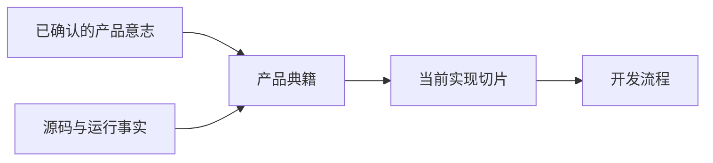

# 产品典籍 Product Canon

<p align="center">
  
</p>

<p align="center">
  <strong>先把产品意志定准，再把实现切片做小。</strong><br>
  <sub>Make product intent authoritative, then make the implementation slice small.</sub>
</p>

> 把已确认的产品意志，整理成稳定的产品核心文档，再收敛成一个可独立演示的实现切片。

`product-canon` 是一个 Codex skill（技能），用于让产品决策保持权威、清晰、有边界，并且能直接服务于开发。它在开始编码前帮助团队回答两个问题：

1. 用户到底确认了什么？
2. 现在最值得实现的最小完整结果是什么？

<details>
<summary>English summary</summary>

`product-canon` is a Codex skill for keeping product decisions authoritative, bounded, and useful to implementation. It turns confirmed intent into one independently demonstrable slice.
</details>



## 什么时候使用 When to use

| 场景 / Need | 模式 / Mode | 产出 / Result |
| --- | --- | --- |
| 启动一个产品 | 建立 / Establish | 最小核心文档结构 |
| 修正一个决定 | 修正 / Correct | 当前决定取代过时决定 |
| 检查产品事实 | 审计 / Audit | 冲突、遗漏、重复与范围漂移 |
| 选择现在要做的事 | 选切片 / Select slice | 一个有验收证据的用户可见结果 |

## 怎么使用 Use

在支持 Codex skills 的环境中这样调用：

```text
使用 $product-canon，把已确认的产品意志整理成稳定的产品典籍，并选出一个有边界的实现切片。
```

技能只读取当前决定所需的上下文，然后返回：

- 当前产品结论；
- 典籍中的冲突或遗漏；
- 实际需要修改的文档位置；
- 一份有边界的当前实现切片简报；
- 仍需要用户授权的决定。

## 边界 Boundaries

- 用户确认的意志高于旧聊天、报告、测试和局部实现细节。
- 产品合同定义目标；源码与运行证据只描述当前事实。
- 一个切片必须独立产生可演示、可验收的用户结果。
- 本技能不会创建第二套任务系统、Gate、调度器、数据库或产品权威。
- 真实供应商、真实账户、实盘订单、持久自动化和数据库迁移，都需要明确范围与授权。

## 仓库结构 Repository layout

```text
.
├── SKILL.md                         # 技能正文与运行边界
├── README.md                        # 中文优先的项目入口
├── assets/product-canon-logo.svg    # 项目 SVG 标志
└── agents/openai.yaml               # 展示元数据与默认调用提示
```

## 设计原则 Design principle

> 先修正权威和切片，再增加实现面。
>
> Fix the authority and the slice before adding implementation surface area.

完整工作流与输出约定见 [`SKILL.md`](SKILL.md)。
